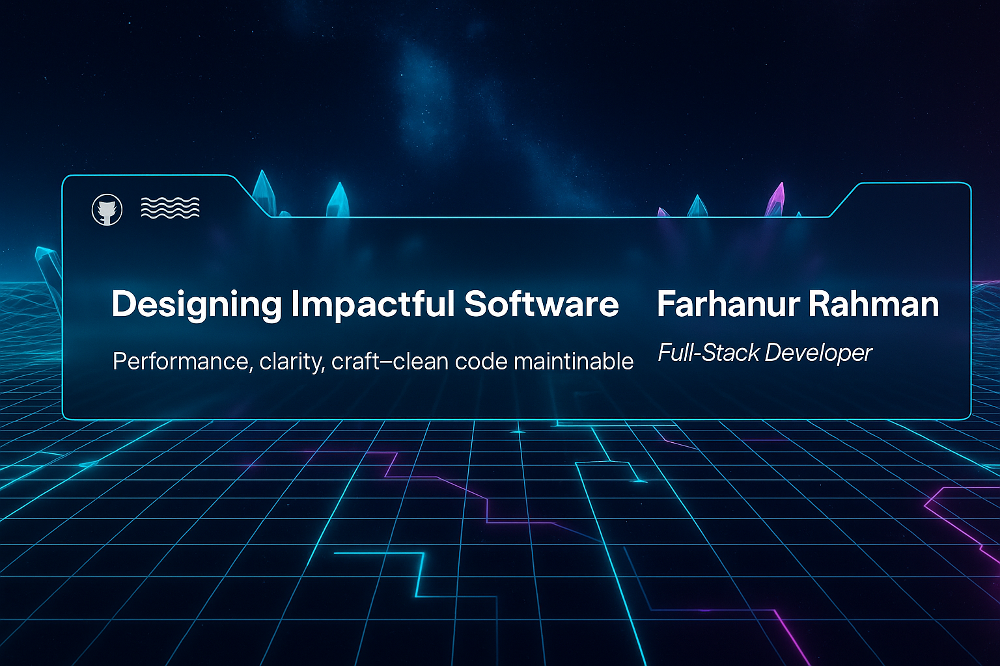

# Hey there, I'm Farhanur Rahman! 👋

A passionate Web Developer and aspiring Software Engineer from MANUU, Hyderabad. I build clean, efficient, and user-focused digital experiences that solve real-world problems with simplicity and impact.

---

## 🚀 Full-Stack Developer | Problem Solver | Tech Enthusiast  

💻 Passionate about building **scalable web applications** using **React.js, Node.js, and MongoDB**.  
⚡ Always exploring new technologies, debugging complex code, and optimizing performance.  
🎯 Currently deep-diving into **backend development, AI, and cloud technologies**.  
💡 Love turning ideas into reality through **clean, efficient, and innovative solutions**.  

📩 **Let’s connect:** farhanrahman0027@gmail.com  
- [LinkedIn](https://www.linkedin.com/in/farhanur-rahman)  
- [Portfolio](https://my-portfolio-plum-nu-99.vercel.app/) 

---

## 🚀 Tech Stack

### 📝 Languages

  
  
  
  

### 🎨 Frontend

  
  
  
  
  
  

### 🖥️ Backend

  
  
  

### 🗄️ Databases

  
  

### 🛠️ Tools

  
  
  

### ☁️ Cloud / DevOps

  
  

## 🚀GitHub Stats

  
  

  

---
## ⚡ Activity Graph

  

---
